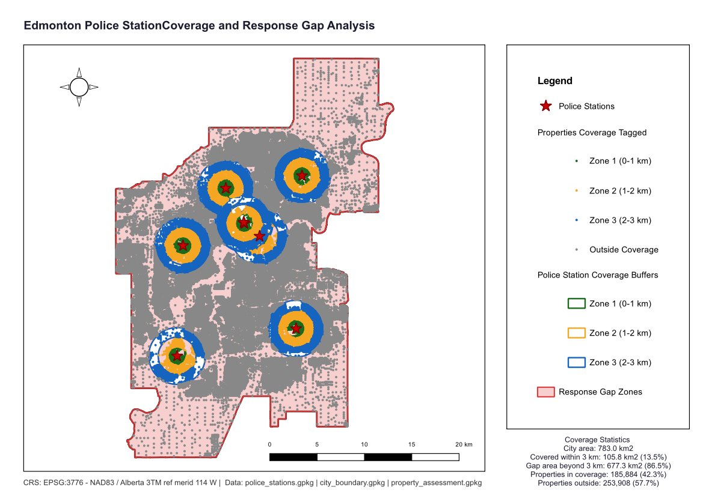

# Police Station Coverage and Response Gap Analysis

**City:** Edmonton, Alberta, Canada
**CRS:** EPSG:3776 - NAD83(CSRS) / Alberta 3TM ref merid 114W
**Project file:** `Police_Station_Coverage_and_Response_Gap_Analysis.qgz`

---

## Overview

This project analyses the spatial coverage of Edmonton's existing police station network and identifies response gap zones where properties are not within a defined service radius. Service area buffers are generated around each station, and properties outside these buffers are classified as response gaps. The output provides a baseline coverage assessment that directly informs the optimal siting analysis in the companion project.

## Reference Layout

---

## Objectives

- Generate service area buffers around all existing Edmonton police stations.
- Identify response gap zones within the city boundary not covered by any station buffer.
- Tag all properties by coverage status (within or outside service area).
- Produce a clean gap zone layer for further analysis and visualisation.

## Methodology

1. Police station point features loaded and reprojected to EPSG:3776: `police_stations.gpkg`.
2. Service area buffers generated around each station to define response coverage zones: `police_station_coverage_buffers.gpkg`.
3. City boundary loaded for spatial extent: `city_boundary.gpkg`.
4. Response gap zones computed by differencing station coverage from city boundary: `response_gap_zones.gpkg`.
5. Property assessment polygons spatially tagged against coverage buffers: `properties_coverage_tagged.gpkg`.

## Output Layers

| File | Description |
|------|-------------|
| `police_stations.gpkg` | Existing police station locations |
| `police_station_coverage_buffers.gpkg` | Service area buffers around each existing station |
| `response_gap_zones.gpkg` | Zones within Edmonton not covered by any existing station buffer |
| `properties_coverage_tagged.gpkg` | Properties tagged as covered or uncovered by existing service areas |
| `city_boundary.gpkg` | Edmonton city boundary |

## Key Findings

- Response gaps are concentrated at the outer edges of Edmonton's built-up area, reflecting the radial pattern of station placement around the city centre.
- A number of industrial and newer residential subdivisions fall within gap zones, highlighting where patrol response times would be longest under the current station layout.
- The gap zone layer serves as the foundational input for the Optimal New Police Station Siting analysis, which uses demand-weighted KDE to propose new station locations within these gaps.

## Deliverables

| File | Type |
|------|------|
| `Police_Station_Coverage_and_Response_Gap_Analysis.qgz` | QGIS project |
| `Police_Station_Coverage_and_Response_Gap_Analysis.pdf` | Exported map layout |
| `reference_layout.png` | Print layout reference image |

## Notes

- All layers use EPSG:3776 (NAD83(CSRS) / Alberta 3TM ref merid 114W).
- This project is the baseline analysis; it is designed to be read alongside the Optimal New Police Station Siting project in the same folder.
- Buffer radius reflects a standard response distance threshold; this should be validated against Edmonton Police Service response time standards for operational use.

## Note
The following files exceed GitHub's 100MB limit and are excluded from this repo:
- `properties_coverage_tagged.gpkg`
